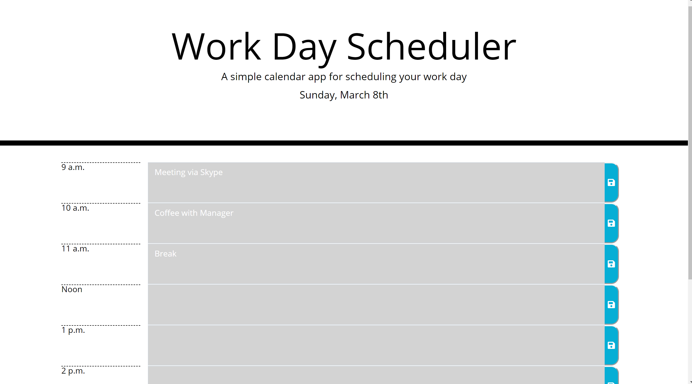

# DayPlanner

 https://ryansalamone.github.io/DayPlanner/

# Application

- Day Planner is a simple calendar application that allows the user to save events for each hour of the day. This app runs in the browser and features dynamically updated HTML and CSS powered by jQuery.
- The app displays standard business hours (9 a.m. to 5 p.m.). Each Time slot is able to be edited to reflect what activity is to be done within that specific time slot.

# Usage
- Clicking on the save button will store the time and user input in localStorage.
- Near the top of the calendar, the application displays the current day. Additionally, each hour is color coded to reflect whether the time slot is in the past, the present, or the future. This changes depending on the time of day.
- This application uses the Moment.js library to work with date and time.

# User Story
- AS AN employee with a busy schedule
- I WANT to add important events to a daily planner
- SO THAT I can manage my time effectively

# Business Context
- Poor time management can result in missed meetings and deadlines or create the appearance of unprofessionalism. A daily planner allows employees to see their day at a glance, schedule time effectively, and improve productivity.